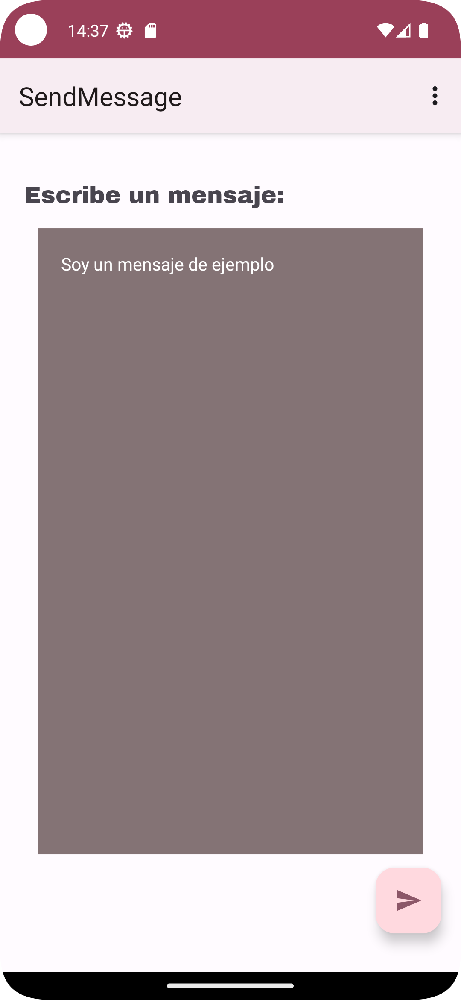
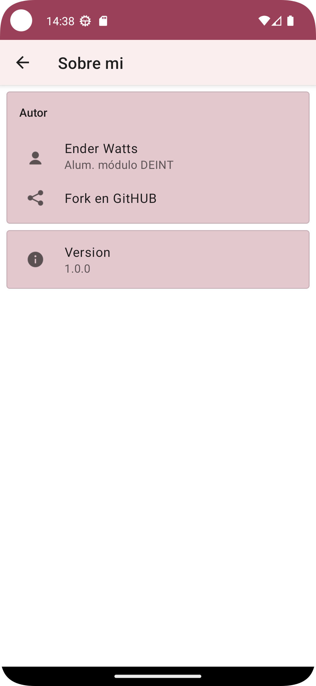
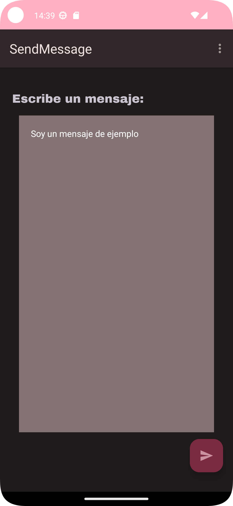
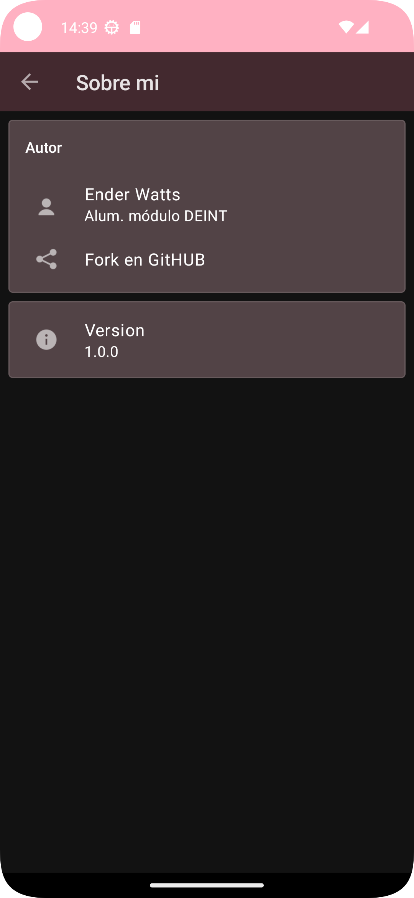

# SendMessageViewBinding

Se ha creado una app en Android Studio que consiste en poder escribir un mensaje y que aparezca en pantalla al darle a un botón. También se ha implementado un menú con un apartado de "Sobre mi", en donde se puede leer información variada como el autor, la versión de la aplicación y un enlace a GitHUB.

<table>
    <tr>
        <th colspan="3">
Modo claro
</th>
    </tr>
    <tr>
        <th></th>
        <th></th>
        <th></th>
    </tr>
    <tr>
        <th colspan="3">
Modo oscuro
</th>
    </tr>
    <tr>
        <th></th>
        <th></th>
        <th></th>
    </tr>
</table>

## Contenidos aprendidos:

### Creación actividades

Se han creado las actividades `SendMessageActivity`, con ConstraitLayout, y `ViewActivity`, con LinearLayout. El estilo se ha ido personalizando a lo largo de las clases, y se ha finalizado creando temas y colores. Lo veremos más adelante.

En `SendMessageActivity` se ha añadido un TextView y un EditView, en el que se escribirá el mensaje a enviar. También se ha insertado un FAB (floating action button). 

En `ViewActivity` se ha añadido otro TextView, donde saldría los datos del destinatario, y abajo saldría el texto enviado en otro TextView.

A cada interfaz se le ha asignado márgenes, paddings y constraints.

### Programar FAB

Se ha aprendido a cómo darle funcionalidad al botón FAB. Se han visto distintas opciones:

1. Crear una clase interna que implemente un `OnClickListener` y el método `onClick()`. Habría que crear una clase para cada botón y no sería nada óptimo.

2. Utilizar una clase anónima directamente, pero el código también crecería considerablemente.

3. Usar expresión lambda. Es la manera más directa y óptima para implementar botones, y sólo ocupa una línea.

### Enviar mensaje a través de Intent

Se ha aprendido el concepto de `Intents` y `Bundles`. En este proyecto se ha utilizado para enviar el mensaje escrito en la primera actividad a la segunda.

Antes de empezar se necesita guardar la información del mensaje que se quiere enviar, como el texto, el destinatario y el receptor. Para ello se crean las clases `Person` y `Message`, que no son más que clases que sólo contienen datos, y que no se programa ningún tipo de lógica en ellas, es decir, son sólo contenedores de información.

Para poder enviar el mensaje se ha implementado un método `sendMessage()`, que consiste en guardar la información del mensaje en un Bundle a través de objetos de la clase Person y Message. Es importante especificar una `KEY` a cada clase.

Hay que tener en cuenta que es necesario que estas clases también sean serializables o parcelables, y para ello hay que implementar la interfaz necesaria a cada una. En este caso se ha decidido por hacerlas parcelables, ya que se ha deprecado ciertos métodos de la clase Serializable y habría que especificar la versión del SDK en la que se ejcutaría la app.

Cuando tengamos el Bundle, éste se añadirá a una instancia de la clase Intent que especifica que se enviará el Intent desde el SendMessageActivity hasta el ViewActivity.

Cuando se inicie el ViewActivity se recogerá el Bundle y se obtendrá de nuevo el objeto message y se inicializará las vistas con el texto obtenidoa partir de un método `inicializeView()`.

### Binding - nueva copia proyecto

Hemos estado utilizando `findViewById` todo este tiempo para inflar las vistas, pero una forma más cómoda y optimizada es utilizar un `binding`. Se ha creado una copia nueva del proyecto, y se han sustituido todo a binding.

### Ciclo de vida

Se utilizan diversos métodos `Callback` para el ciclo de vida de cada actividad, entre ellas están `onCreate()`, onStart(), on Stop(), onDestroy(), etc. Es importante que cuando una actividad se cierre, que dentro del método `onDestroy()` se libere los recursos en memoria anulando el valor de binding.

Se ha aprendido también cómo se guardan cada actividad en la pila de actividad a medida que se van ejecutando.

El ciclo de vida de cada actividad se comprueba mediante `Logs`, que son mensajes de depuración que aparecen en la pestaña `Logcat` cuando está ejecutándose el dispositivo / emulador.

### Debug - puntos de interrupción condicional

Una herramienta muy útil para depurar nuestra aplicación es utilizar los puntos de interrupción condicional, y consiste en que si la condición dada se cumple, la aplicación para de ejecutarse y se pasa a modo depuración. Esto es muy cómodo para probar casos con valores específicos que sabemos que no son comunes o normales, y que se pueda ver el motivo para poder resolverlo rápidamente.

### Recursos y estilo aplicación

Se ha aprendido a crear recursos de strings, dimensiones, fuentes, colores y temas. También se ha localizado la aplicación en inglés, y se ha aprendido a crear un layout en modo paisaje.

El tema de la aplicación se ha descargado desde la página de [Material Theme Builder](https://m3.material.io/theme-builder), y también se ha customizado el color de fondo del EditView y se ha cambiado las fuentes.

### Menú y AboutActivity

El menú se ha implementado siguiendo una guía en la [página oficial de Android](https://developer.android.com/guide/topics/ui/menus?hl=es-419#java). En nuestro menú solo se tiene un apartado llamado "Sobre mí", en el cual aparece toda la información del autor y de la versión de la aplicación, además de un enlace hacia su página de GitHUB

Esta interfaz `AboutActivity `se ha implementado gracias a un repositorio en GitHUB llamado [material-about-library](https://github.com/daniel-stoneuk/material-about-library), en el cual se puede fácilmente personalizar las tarjetas, incluso su estilo.
